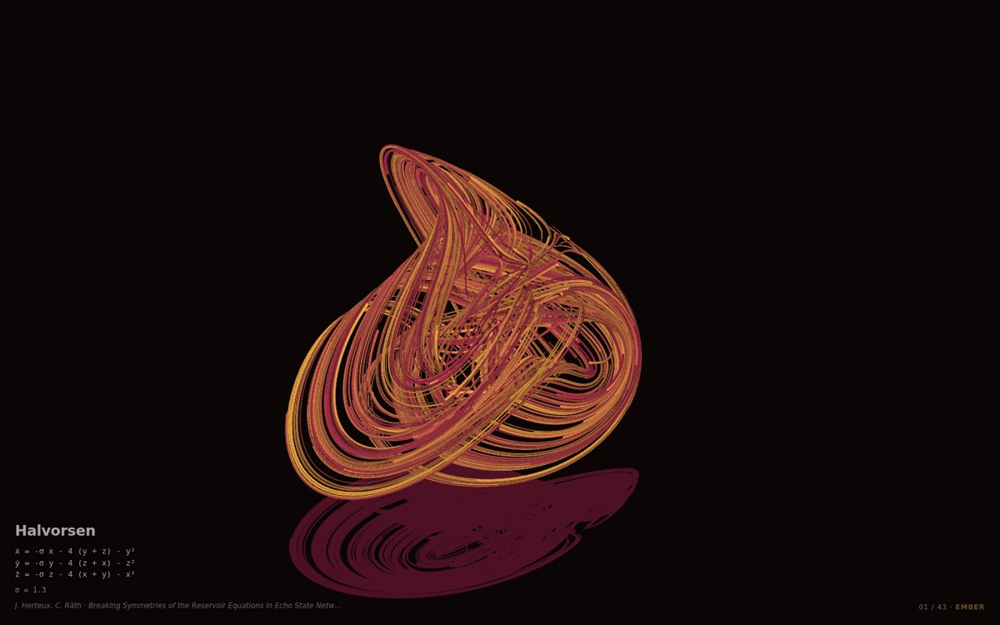
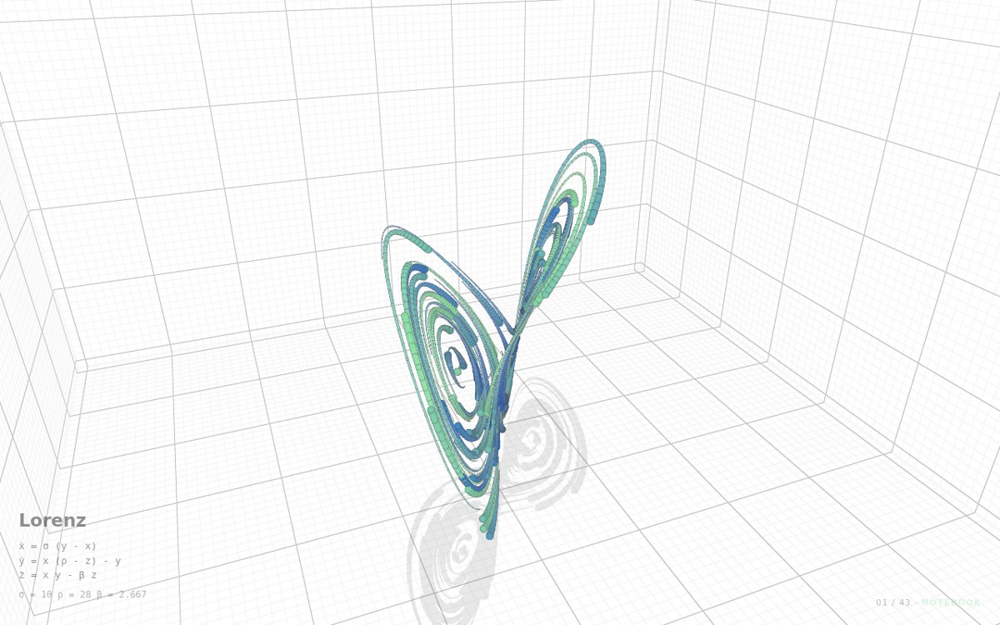

# Strange Attractor Screensaver

Forty-three strange attractors, integrated and drawn entirely on the GPU, cycling
one after another as a screensaver. A direct port of Ricky Reusser's
[*Strange Attractors on the GPU, Part 2*](https://observablehq.com/@rreusser/strange-attractors-on-the-gpu-part-2)
— same systems, same parameters, same Runge–Kutta-on-a-texture trick — rebuilt as
a dependency-free WebGL2 page with a director that keeps it interesting for hours.




## Run it

```sh
bin/attractors              # interactive window
bin/attractors --idle       # screensaver mode: no cursor, any input dismisses it
```

The launcher starts a throwaway static server on localhost and opens a kiosk
browser window at it. It finds Chromium, Chrome, Brave, Edge or Firefox, native
or Flatpak; set `ATTRACTORS_BROWSER` to override.

You can also build a single self-contained file and open it anywhere:

```sh
node tools/build-single.mjs     # -> dist/attractors.html
```

## Install as the actual screensaver

```sh
./install.sh 300            # kick in after 300 seconds idle
```

This writes two systemd user units. `attractor-idle.service` runs `swayidle`,
which listens on `ext-idle-notify-v1` (KWin 6 speaks it, as do the wlroots
compositors) and starts `attractor-screensaver.service` when the session goes
quiet. Touching anything makes the page call `/__quit`, which tears the server
and the browser window down together; `swayidle`'s resume hook stops the unit as
a backstop.

```sh
systemctl --user start attractor-screensaver.service   # try it now
journalctl --user -u attractor-idle -u attractor-screensaver -f
```

Run `install.sh` on the host, not inside a toolbox or container.

## Controls

Interactive mode only — in `--idle` mode any input dismisses the screensaver.

| | |
|---|---|
| <kbd>←</kbd> <kbd>→</kbd> | previous / next attractor |
| <kbd>R</kbd> | reroll the palette, camera and line style |
| <kbd>space</kbd> | hold on this one |
| <kbd>H</kbd> | hide the overlay |
| <kbd>F</kbd> | fullscreen |
| drag / scroll | orbit / zoom |

## Options

Passed as query parameters, or as bare arguments to `bin/attractors`:

```sh
bin/attractors --idle duration=30 theme=dark particles=2048
```

| | default | |
|---|---|---|
| `duration` | `45` | seconds per attractor; `0` holds the first one forever |
| `fade` | `1.4` | seconds of cross-fade between attractors |
| `theme` | `any` | `dark`, `paper`, or `any` |
| `attractor` | — | pin the opening system, e.g. `attractor=Lorenz` |
| `particles` | `1024` | trajectories simulated in parallel |
| `steps` | `180` | samples per trail, i.e. how long the comet tails are |
| `speed` | `1` | integration steps per display frame |
| `dpr` | `1.75` | device-pixel-ratio ceiling |
| `hud` | `1` | `0` hides the name and equations |
| `idle` | off | screensaver behaviour |

Resolution adapts on its own: the renderer watches frame cost and moves up or
down a five-rung quality ladder, but only ever between attractors, where the
change is hidden by the fade.

## How it works

**State.** One `RGBA32F` texture, `steps` wide by `particles` tall. Texel
`(column, row)` is where trajectory `row` was at trail slot `column`. Columns are
a ring buffer.

**Integration.** Each frame a fragment shader reads the head column, takes a
4th-order Runge–Kutta step through the attractor's derivative — compiled into the
shader from the system's own GLSL source — and writes a one-pixel-wide column,
which is then blitted back into the ring. Trajectories that escape are pulled
back along their ray; ones that go non-finite are re-seeded.

**Drawing.** Every segment and every joint is an instanced quad whose corners the
vertex shader places in *screen* space, so stroke width is in pixels regardless of
depth. Joints are drawn first as discs and the segments over them, which leaves
exactly the wedge a corner needs plus round caps at the ends. Coverage comes from
an SDF resolved by alpha-to-coverage against the multisampled framebuffer, so the
whole pass stays opaque and depth-tests against itself without sorting.

**Framing.** The notebook hand-tuned a view transform per attractor. Those are
kept, but after each system settles its trail buffer is read back and the camera
fits a bounding sphere around the 98.5th percentile of it — so a sprawling system
gets a hall and a compact one gets a room, and one escaping particle cannot drag
the camera into the next county.

## Layout

```
index.html                 page shell, overlay, styling
src/attractors.js          the 43 systems (generated)
src/simulation.js          state texture, RK4 integrator, spin-up
src/lines.js               instanced trail renderer
src/stage.js               the grid room and floor
src/camera.js              orbit camera and sphere fitting
src/director.js            playlist, palettes, transitions
src/palettes.js            15 colour schemes
src/scene.js               frame composition
src/format.js              GLSL derivatives -> readable equations
src/main.js                loop, quality ladder, input
bin/attractors             kiosk launcher
bin/serve.py               static server with a /__quit endpoint
tools/gen-attractors.mjs   regenerate src/attractors.js from the notebook
tools/build-single.mjs     bundle to dist/attractors.html
```

To re-derive the attractor table from the source notebook:

```sh
curl -sL "https://api.observablehq.com/@rreusser/strange-attractors-on-the-gpu-part-2.js?v=4" -o notebook.js
node tools/gen-attractors.mjs
```

## Requirements

WebGL2 with `EXT_color_buffer_float` (float render targets), which every current
desktop browser has. `python3` for the launcher's static server, and `swayidle`
only if you want the idle trigger.

## Credit

All forty-three systems, their parameters, the view transforms, the quasirandom
seeding and the grid room are Ricky Reusser's, from
[*Strange Attractors on the GPU, Part 2*](https://observablehq.com/@rreusser/strange-attractors-on-the-gpu-part-2)
(and [Part 1](https://observablehq.com/d/ab6cd8bb0137889c), which explains the
simulation properly). Each attractor's own paper is cited in the overlay.
